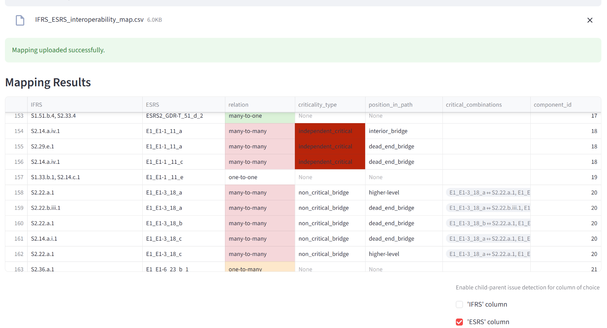
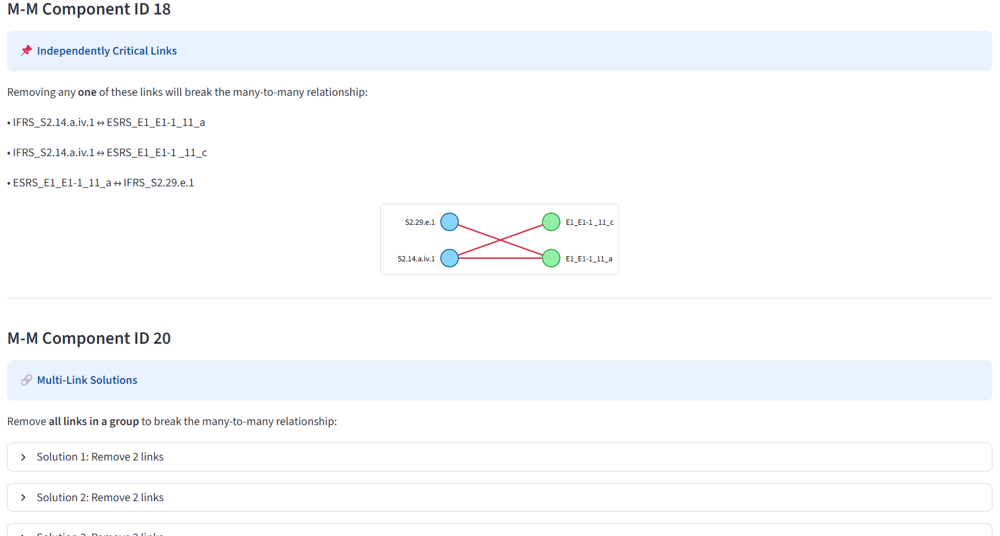

# App Mapping Relationships

A small Streamlit app for analysing mapping relationships between two taxonomies or entity lists. It reads a two-column CSV (juncture table of 2 foreign keys), classifies each mapping as one-to-one, one-to-many, many-to-one, or many-to-many, and highlights critical links inside many-to-many clusters.

## Features

- Upload a CSV with exactly two columns.
- Classify each mapping row by relationship type.
- Detect many-to-many components in the mapping graph.
- Flag independent critical edges and edge combinations that break many-to-many structures.
- Optionally analyse parent-child style issues within each component.
- Visualise each problematic component with a compact graph view.





## Getting Started

### Prerequisites

- Python 3.10 or newer
- `pip`

### Installation

```bash
python -m venv .venv
.venv\Scripts\activate
pip install -r requirements.txt
```

### Run the app

```bash
streamlit run app.py
```

## Input Format

The app expects a CSV file with exactly two columns. The first column is treated as the left side of the mapping and the second as the right side.

Example:

```csv
IFRS_9,ESRS_E1
IFRS_15,ESRS_E2
IFRS_15,ESRS_E3
```

The app includes a download button for a sample CSV you can use as a template.

## Running Tests

```bash
pytest
```